<picture>
  <source media="(prefers-color-scheme: dark) and (max-width: 600px)" srcset="./assets/banner-dark-sm.svg">
  <source media="(max-width: 600px)" srcset="./assets/banner-light-sm.svg">
  <source media="(prefers-color-scheme: dark)" srcset="./assets/banner-dark.svg">
  <source media="(prefers-color-scheme: light)" srcset="./assets/banner-light.svg">
  
</picture>

<h3 align="center">I turn rough ideas into useful software.</h3>

  企画から運用まで。曖昧な課題を、実際に使えるプロダクトへ。 
  From the first sketch to production — product, design, code, security, and operations.

  <code>PLAN</code> → <code>DESIGN</code> → <code>BUILD</code> → <code>SHIP</code> → <code>IMPROVE</code>

  
  
  

## Now

<table>
  <tr>
    <td valign="top">
      BUILDING IN PUBLIC · ONGOING
      <h3>100 DAYS / 100 APPS</h3>
      

        One small web app, shipped every day. Each build records what I delegated to AI,
        what I decided myself, and what broke on the way to production.
      

      

        <a href="https://hundred-days.pages.dev/"><strong>Browse the live apps ↗</strong></a>
        &nbsp;·&nbsp;
        <a href="https://github.com/haranishi/hundred-days">View source ↗</a>
      

      
<code>JavaScript</code> <code>Cloudflare Pages</code> <code>APIs</code> <code>AI-assisted development</code>

    </td>
  </tr>
</table>

## Selected work

<table>
  <tr>
    <td width="50%" valign="top">
      01 · LIVE PRODUCT
      <h3>ザリダス / Zaridasu</h3>
      

        Citizen-science app for mapping invasive species. AI-assisted identification turns
        field photos into sightings that conservation groups can act on.
      

      

        Built solo, including the review queue, location privacy, EXIF stripping,
        multilingual UI, and security review.
      

      
<code>Next.js</code> <code>Supabase</code> <code>Gemini API</code> <code>R3F</code> <code>PWA</code>

      
    </td>
    <td width="50%" valign="top">
      02 · LIVE PRODUCT
      <h3>シュフト / Shuft</h3>
      

        Shift scheduling for small shops still running on paper and group chat.
        Share one URL and the team can start without creating accounts.
      

      

        Covers multiple stores, shift requests, reusable templates, and image/PDF export.
        The live demo opens with sample data.
      

      
<code>Next.js</code> <code>Supabase</code> <code>jsPDF</code>

      
    </td>
  </tr>
</table>

## How I work

| Product | Engineering | Operations |
|:--|:--|:--|
| Find the smallest useful version and ship it. | Own the full stack instead of throwing work over a wall. | Build the monitoring and recovery path, not only the happy path. |
| Start from the user's decision, not a feature list. | Treat accessibility, privacy, and security as product work. | Keep improving after launch with real usage and failures. |

## Stack

`TypeScript` · `Next.js` · `React` · `Three.js` · `Python` · `Supabase` · `PostgreSQL` · `Cloudflare` · `AI APIs`

  
<strong>More things I build</strong>

   

- **Automation that runs unattended** — scheduled jobs, scraping, Sheets pipelines,
  generated media, and the diagnostics that catch quiet failures.
- **Client products through Lilac** — websites, landing pages, product MVPs, and system
  migrations. Most of this work stays private or under NDA.
- **AI production systems** — workflows that turn research and structured inputs into
  repeatable content, without losing the human review step.

 

<h2 align="center">Have something worth shipping?</h2>

  I run <strong>Lilac</strong>（ライラック）, a one-person product studio in Japan. 
  Currently open to selected web products, MVPs, and automation projects.

  

  <a href="https://rairakku.vercel.app">Portfolio</a>
  &nbsp;·&nbsp;
  <a href="https://github.com/haranishi/hundred-days">100 Days</a>
  &nbsp;·&nbsp;
  <a href="mailto:lilac.webstudio00@gmail.com">Email</a>

