<picture>
  <source media="(max-width: 600px)" srcset="./assets/tetris-banner-sm.svg">
  
</picture>

<h2 align="center">100日、100個のWebアプリ。</h2>

  AIと一緒に、毎日ひとつ小さなアプリをつくる100日チャレンジ。 
  つくって、公開して、また次へ。

  <a href="https://hundred-days.pages.dev/"><kbd>▶ つくったアプリを見る</kbd></a>
  &nbsp;&nbsp;
  <a href="https://github.com/haranishi/hundred-days"><kbd>⌘ ソースコード</kbd></a>

